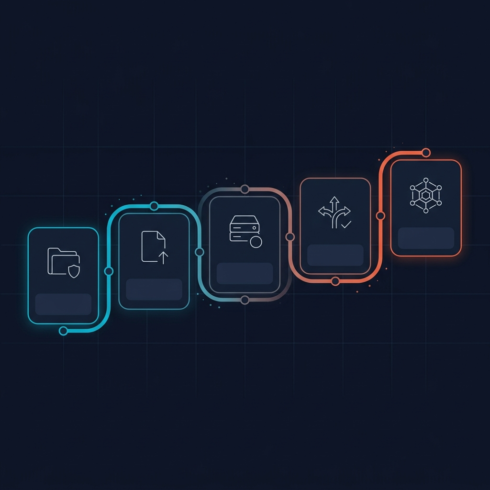
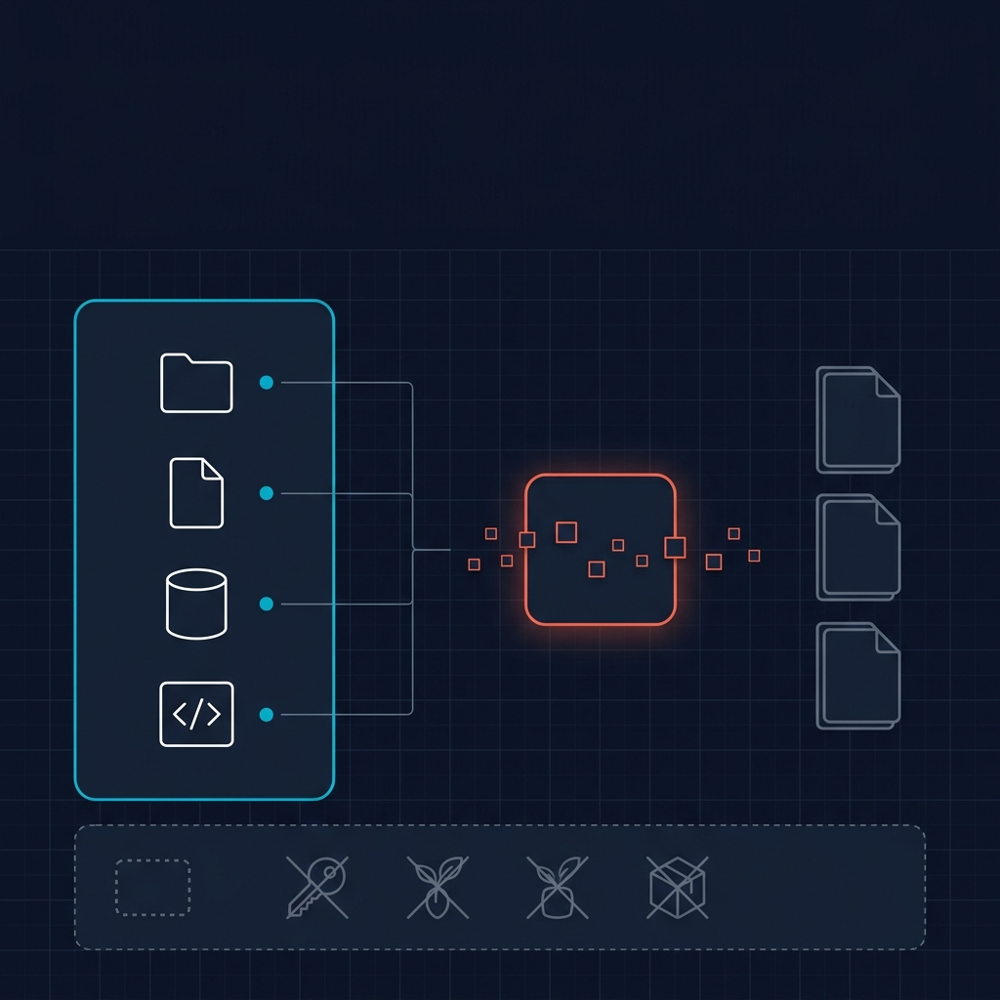
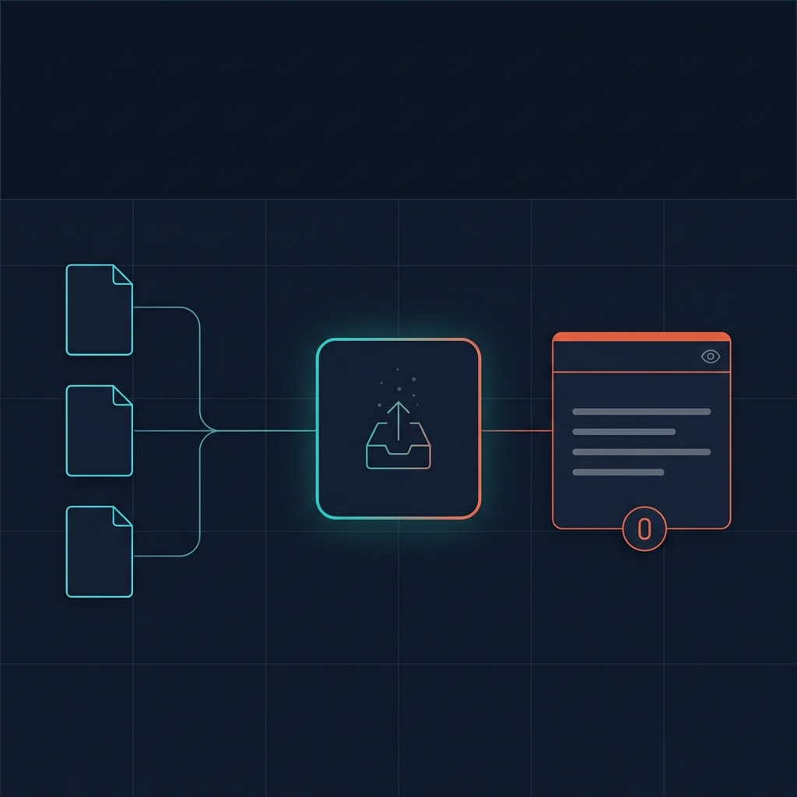
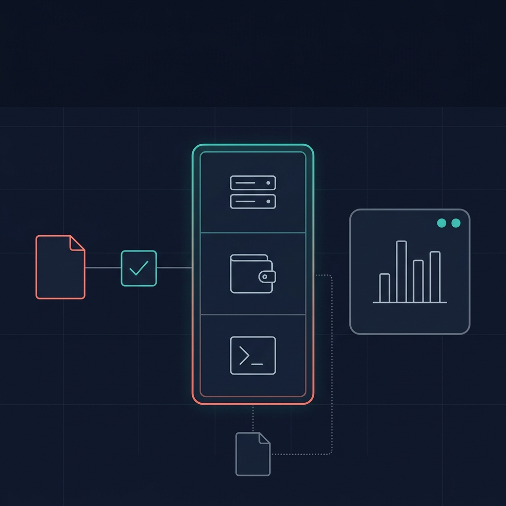
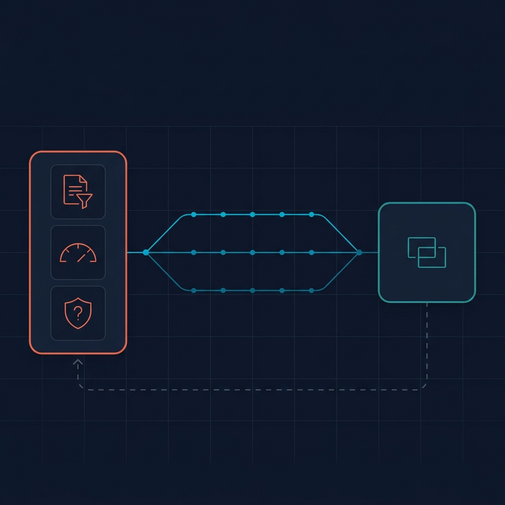
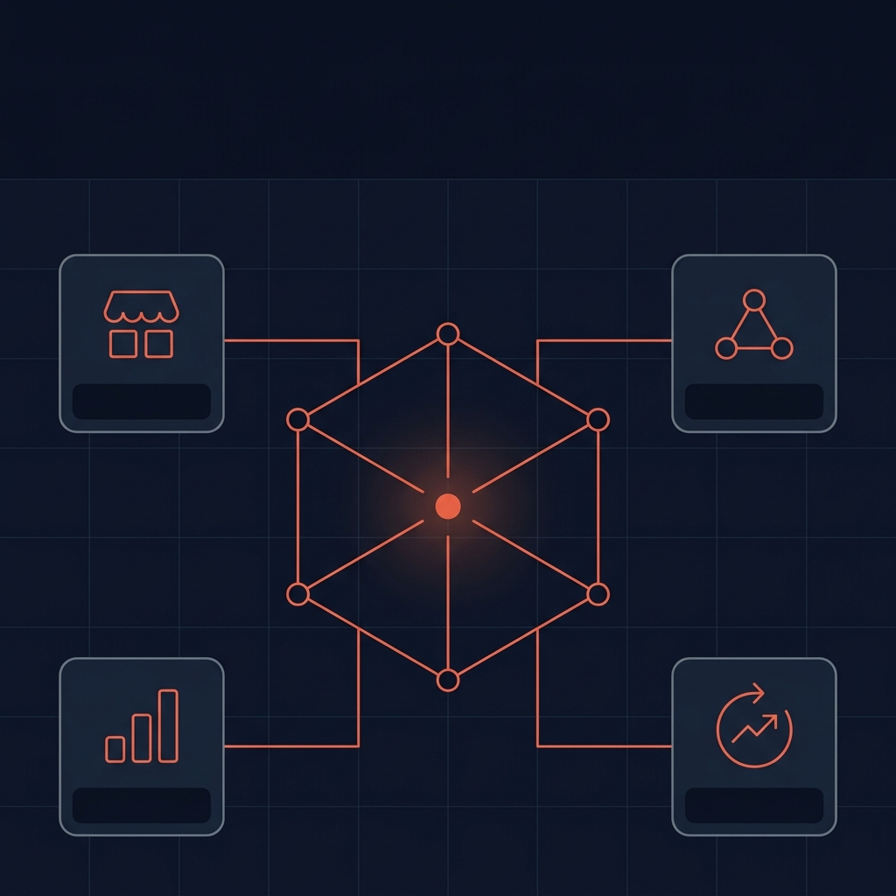

# Syrin User Guide: Micro ECF To Agent OS

Micro ECF gives Syrin users a local, inspectable context and policy layer before moving an agent into hosted Agent OS.

Product boundary:

```text
Micro ECF = local context and policy packets
ECF Core = open-source self-hosted context governance when static packets are not enough
Agent OS = hosted deployment, budgets, APIs, receipts, marketplace access
Full ECF = private/internal Agoragentic infrastructure
```

Micro ECF does not deploy, spend funds, publish listings, provision runtime, settle x402, expose secrets, or expose Full ECF internals.

## Roadmap



Overlay labels for the roadmap image:

| Stage | Label | Caption |
|-------|-------|---------|
| 1 | Local Context | Index bounded repo, docs, database summaries, and API docs without exposing secrets. |
| 2 | Harness Export | Build source-map, policy-summary, context-packet, deployment-preview, and harness-export artifacts. |
| 3 | Agent OS Preview | Run readiness and preview before recording any hosted deployment request. |
| 4 | Governed Autonomy | Add pre-action review, budget gates, receipts, reconciliation, and owner approval. |
| 5 | Earned Autonomy | Expand autonomy only after proof, trust evidence, and explicit owner approval. |

The path is:

1. Local context setup with Micro ECF.
2. Preview and export an Agent OS Harness packet.
3. Record a first hosted deployment request in Agent OS.
4. Add governed autonomy with review, receipts, and reconciliation.
5. Graduate only after trust, evidence, and owner approval justify more autonomy.

## Stage 1: Local Context Setup



Caption: Local context setup turns allowed local sources into source maps, policy summaries, and context packets while blocked files stay out of the export.

Install Micro ECF in the project you want Syrin or another local agent to understand.

```bash
npx agoragentic-micro-ecf@latest explain
npx agoragentic-micro-ecf@latest plan --dir .
```

Review the plan first. It is read-only.

After approval:

```bash
npx agoragentic-micro-ecf@latest install --dir . --yes
```

This creates local artifacts only:

```text
AGENTS.md
MICRO_ECF_LLM_BOOTSTRAP.md
.micro-ecf/policy.json
.micro-ecf/source-map.json
.micro-ecf/context-packet.json
.micro-ecf/policy-summary.json
.micro-ecf/deployment-preview.json
.micro-ecf/harness-export.json
```

## Stage 2: Preview And Export



Caption: Preview and export packages Micro ECF artifacts into an Agent OS Harness file. This step is no-spend and non-provisioning.

Index bounded project context, then build and export the Harness packet.

```bash
npx agoragentic-micro-ecf@latest index ./docs --output-dir .micro-ecf
npx agoragentic-micro-ecf@latest build-packet --policy .micro-ecf/policy.json --source-map .micro-ecf/source-map.json --output-dir .micro-ecf
npx agoragentic-micro-ecf@latest export --agent-os --policy .micro-ecf/policy.json --output .micro-ecf/harness-export.json
```

For a repo without a `docs` folder, index the smallest useful folder instead, such as `./src`, `./app`, `./examples`, or a bounded local database summary export.

## Stage 3: First Agent OS Handoff



Caption: The first Agent OS handoff checks readiness and preview before recording a hosted deployment request.

Agent OS is hosted. Use the CLI to check the Micro ECF Harness export and preview the deployment request.

```bash
AGORAGENTIC_API_KEY=amk_your_key npx agoragentic-os@latest deploy readiness --file .micro-ecf/harness-export.json
AGORAGENTIC_API_KEY=amk_your_key npx agoragentic-os@latest deploy preview --file .micro-ecf/harness-export.json
```

Stop here if you only want a no-spend readiness check.

If you want deeper local eval before this handoff, use ECF Core:

```bash
npm install -g agoragentic-ecf-core
ecf-core init .
ecf-core compile . --agent-os
ecf-core eval . --grounding
ecf-core agent-os-preview .ecf-core
```

Use Micro ECF for the light local wedge. Use ECF Core when you need a self-hosted context-governance runtime. Use Agent OS only when you are ready for hosted deployment flow.

When the owner is ready to record the hosted deployment request:

```bash
AGORAGENTIC_API_KEY=amk_your_key npx agoragentic-os@latest deploy create --file .micro-ecf/harness-export.json
```

`deploy create` records the deployment request. Funding, runtime provisioning, public API exposure, marketplace selling, and x402 monetization remain separate gated steps.

## Stage 4: Governed Autonomy



Caption: Governed autonomy means pre-action review, bounded execution, receipts, reconciliation, and review gates before side effects.

Before an agent gets more autonomy, keep side effects proposal-first:

- Use Micro ECF artifacts to define allowed context, blocked sources, budget rules, approval rules, and review requirements.
- Use Agent OS preview and deployment checks before enabling live hosted runtime behavior.
- Use `execute(task, input, constraints)` for routed work instead of hardcoding providers.
- Require owner approval for spending, deployment changes, public exposure, marketplace listing, x402 exposure, and secret changes.

## Stage 5: Earned Autonomy



Caption: Full autonomy is a later trust state. It requires evidence, successful runs, reconciliation, budget controls, and owner approval.

Full autonomy is earned, not switched on by Micro ECF.

Only move toward higher autonomy after the agent has:

- a clear deployment contract
- bounded budget and approval policy
- receipt-backed proof of useful work
- reconciliation against intended outcomes
- trust evidence from repeated successful runs
- explicit owner approval for new exposure or spend

## Use Micro ECF In Future LLM Chats

Micro ECF creates repo artifacts. It does not create hidden global memory.

For new chats:

- If your IDE reads repo instructions, ask the assistant to read `AGENTS.md` and the `.micro-ecf/*` artifacts.
- If it does not, paste or attach `MICRO_ECF_LLM_BOOTSTRAP.md`.
- If your IDE supports MCP, run `npx agoragentic-micro-ecf@latest serve-mcp --root .micro-ecf`.

Ask the assistant to disclose whether it used Micro ECF artifacts, the MCP server, direct repo reads, or none of them.

## What To Post In Discord

```text
Micro ECF is live for Syrin users.

It lets you create local context and policy packets before moving an agent into hosted Agent OS.

Quick path:
1. npx agoragentic-micro-ecf@latest explain
2. npx agoragentic-micro-ecf@latest plan --dir .
3. npx agoragentic-micro-ecf@latest install --dir . --yes
4. npx agoragentic-micro-ecf@latest index ./docs --output-dir .micro-ecf
5. npx agoragentic-micro-ecf@latest build-packet --policy .micro-ecf/policy.json --source-map .micro-ecf/source-map.json --output-dir .micro-ecf
6. npx agoragentic-micro-ecf@latest export --agent-os --policy .micro-ecf/policy.json --output .micro-ecf/harness-export.json
7. AGORAGENTIC_API_KEY=amk_your_key npx agoragentic-os@latest deploy readiness --file .micro-ecf/harness-export.json
8. AGORAGENTIC_API_KEY=amk_your_key npx agoragentic-os@latest deploy preview --file .micro-ecf/harness-export.json

Micro ECF is local-only. It does not deploy, spend, publish, provision, settle x402, or expose Full ECF internals.
```
