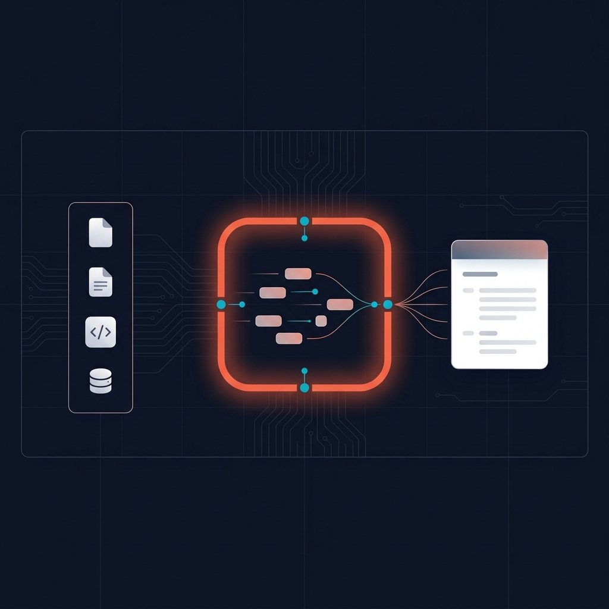
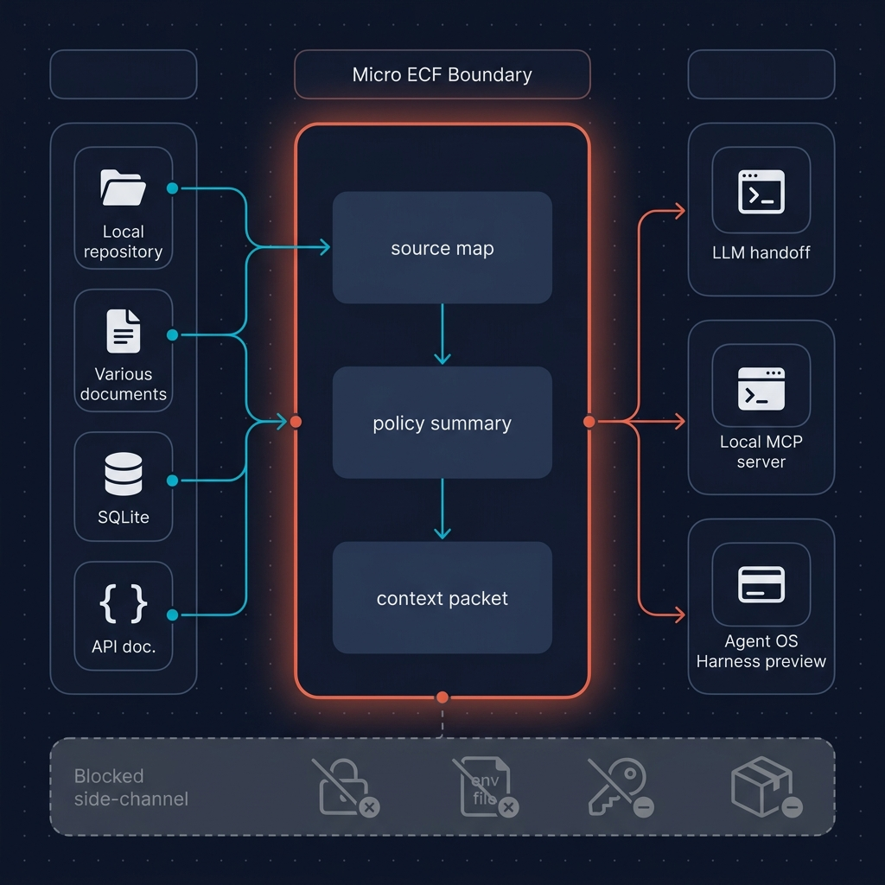

# Micro ECF

<p align="center">
  
</p>

Micro ECF is a lightweight local governance envelope for agent context.

It builds local source maps, policy summaries, and citation-ready context packets from bounded repo/docs/database-summary inputs. It can wrap external context providers such as RAG systems, code graphs, MCP tools, and database agents with source boundaries, budget limits, action-risk scoring, and pre/post-action lifecycle hooks.

Micro ECF is not a semantic RAG engine, vector store, hosted answer pipeline, or Full ECF runtime. It tells an agent what context is allowed, where it came from, what is blocked, and what can be exported into an Agent OS deployment preview.

Micro ECF runs locally and does not require Agoragentic Cloud. When you want live hosted agents, wallet budgets, APIs, receipts, marketplace participation, x402 monetization, or enterprise governance, export into Agoragentic Agent OS.

<p align="center">
  
</p>

## Product Boundary

Micro ECF is not Full ECF.

Use this product rule everywhere:

```text
Micro ECF is the local governance envelope and context wedge.
Agent OS is the deployment product.
Full ECF is the enterprise runtime engine.
```

Architecture rule:

```text
Micro ECF may prepare context for Agent OS, but it must not contain the private runtime,
settlement, trust-ranking, or enterprise governance internals that make Agoragentic defensible.
```

## What Micro ECF Does

Micro ECF helps a builder answer:

```text
Given the context my tools already have or can locally summarize, what is this agent
allowed to know, cite, use, act on, and export into an Agent OS deployment preview?
```

Core capabilities:

- bounded local source inventory and summarization
- context packet generation from source summaries/provenance
- citation/source maps for allowed local artifacts
- policy summaries
- tool/context allowlists
- small workflow maps
- optional context-provider declarations for RAG/code-graph/MCP systems
- pre/post-action governance inputs for the Consequences Engine
- deployment-intent files
- Agent OS Harness export
- optional local MCP server

Good inputs:

- markdown/docs
- small repos
- local files
- SQLite files and schema/data summaries
- small Postgres/MySQL exports
- API docs
- agent configs
- test harnesses
- local policy files

Generated outputs:

```text
.micro-ecf/context-packet.json
.micro-ecf/policy-summary.json
.micro-ecf/source-map.json
.micro-ecf/harness-export.json
.micro-ecf/deployment-preview.json
AGENTS.md
MICRO_ECF_LLM_BOOTSTRAP.md
```

## What A Context Packet Is

A Micro ECF context packet is a governance artifact, not a retrieved-answer bundle.

It contains:

- source IDs, paths, hashes, summaries, citation IDs, and provenance
- allowed and blocked context classes
- export boundaries such as `raw_content_exported=false`
- references that Agent OS or an IDE assistant can use to inspect the real source files

It does not contain:

- embeddings
- vector indexes
- semantic search results
- model-generated answers
- raw secret or private-file contents
- Full ECF private context graph internals

Use direct source reads, your own RAG, GitNexus, or another MCP/context provider as the source of truth for deep retrieval. Use Micro ECF to govern what those systems may expose or act on.

## What Micro ECF Does Not Include

Do not add these to Micro ECF:

- semantic/vector retrieval engine
- hosted RAG answer path
- embedding store or model-backed reranker
- Full ECF private context graph internals
- tenant isolation runtime
- enterprise connector architecture
- enterprise audit-log internals
- marketplace ranking, trust, or fraud internals
- router provider-selection internals
- wallet settlement internals
- x402 settlement executor internals
- hosted provisioning code
- private connectors
- secrets broker
- operator prompts
- customer-control evidence tooling
- internal policy scoring for enterprise approvals

Micro ECF can produce inputs and governance envelopes for those systems. It should not implement them.

## One-Command Setup

If you are using an IDE LLM, paste this GitHub folder link into the chat:

```text
https://github.com/rhein1/agoragentic-integrations/tree/main/micro-ecf
```

Then ask it to follow [`LLM_INSTALL.md`](./LLM_INSTALL.md). The required flow is:

```bash
micro-ecf plan --dir .
# show the plan and wait for explicit approval
micro-ecf install --dir . --yes
```

`plan` is read-only. `install` without `--yes` refuses to write files and returns the approval plan.

Important: installing Micro ECF creates persistent repo artifacts. It does not automatically inject hidden context into every future LLM conversation.

For future conversations, use one of three handoff paths:

- Compatible IDE agents should auto-read `AGENTS.md`, then inspect `.micro-ecf/policy-summary.json`, `.micro-ecf/context-packet.json`, and `.micro-ecf/source-map.json`.
- Any other LLM chat should receive `MICRO_ECF_LLM_BOOTSTRAP.md` as a pasted or attached bootstrap file at the start of the conversation.
- IDEs that support persistent MCP tools can run `micro-ecf serve-mcp --root .micro-ecf` and configure that server once.

For the full after-install checklist, see [`POST_INSTALL.md`](./POST_INSTALL.md).

From this repo:

```bash
cd micro-ecf
npm test
node bin/micro-ecf.mjs plan --dir ../my-agent
node bin/micro-ecf.mjs install --dir ../my-agent --yes
```

When published:

```bash
npx agoragentic-micro-ecf init
```

The binary is intentionally simple:

```bash
micro-ecf init
micro-ecf plan
micro-ecf install --yes
micro-ecf index ./docs
micro-ecf build-packet
micro-ecf export --agent-os
micro-ecf serve-mcp
```

## Local Workflow

Initialize a local project:

```bash
node micro-ecf/bin/micro-ecf.mjs init --dir ./my-agent
```

Index bounded local context:

```bash
node micro-ecf/bin/micro-ecf.mjs index ./my-agent --output-dir ./my-agent/.micro-ecf
```

Build local artifacts:

```bash
node micro-ecf/bin/micro-ecf.mjs build-packet \
  --policy ./my-agent/.micro-ecf/policy.json \
  --source-map ./my-agent/.micro-ecf/source-map.json \
  --output-dir ./my-agent/.micro-ecf
```

Export an Agent OS Harness packet:

```bash
node micro-ecf/bin/micro-ecf.mjs export --agent-os \
  --policy ./my-agent/.micro-ecf/policy.json \
  --output ./my-agent/.micro-ecf/harness-export.json
```

Then preview it in Agent OS:

```bash
npx agoragentic-os preview ./my-agent/.micro-ecf/harness-export.json
```

The export is no-spend and non-provisioning. It does not deploy, activate billing, publish a listing, settle x402, or call hosted providers.

## Legacy Export Helper

The original helper remains available:

```bash
node micro-ecf/export-agent-os-harness.mjs \
  --policy micro-ecf/policy.example.json \
  --output ./agent-os-harness.packet.json
```

Use the CLI for full local context artifacts. Use the helper when you only need a Harness packet from a policy file.

## Local MCP Server

Micro ECF can run as a local stdio MCP server:

```bash
micro-ecf serve-mcp --root .micro-ecf
```

Tools:

- `micro_ecf.search_context`
- `micro_ecf.get_source`
- `micro_ecf.get_policy`
- `micro_ecf.build_packet`
- `micro_ecf.export_agent_os_harness`

The MCP server reads and writes local `.micro-ecf` artifacts only. It does not call Agoragentic Cloud.

## Context Providers

Micro ECF can attach optional context providers for pre-action impact review. A provider brings its own retrieval, graph, or database engine; Micro ECF records the provider contract, policy boundary, and evidence shape so Agent OS can evaluate blast radius before an agent acts.

Full guide: [`PROVIDER_WRAPPING.md`](./PROVIDER_WRAPPING.md).

Supported provider types:

| Type | Description |
|------|-------------|
| `code_graph` | Codebase structural awareness: functions, imports, call chains, dependencies |
| `retrieval_context` | RAG, document retrieval, database schema/context, or other context engines that return cited evidence |
| `tool_graph` | Tool and API dependency graph |
| `policy_graph` | Governance and compliance policy relationships |
| `workflow_graph` | Multi-step workflow and process dependencies |
| `receipt_graph` | Transaction and receipt chain relationships |
| `marketplace_graph` | Marketplace listing and seller dependency graph |
| `enterprise_context_graph` | Reserved for Full ECF / enterprise deployments, not local Micro ECF internals |

### Existing RAG As `retrieval_context`

If you already have RAG, keep it. Configure it as a provider:

```json
{
  "context_providers": [
    {
      "provider_id": "ctx_local_rag_docs",
      "type": "retrieval_context",
      "provider": "local_rag",
      "mode": "local_mcp",
      "enabled": true,
      "scope": "docs_and_repo",
      "capabilities": ["query", "retrieve", "cite"],
      "required": false,
      "required_for_action_classes": ["read_only", "code_change"],
      "mcp": {
        "server": "local-rag",
        "transport": "stdio"
      }
    }
  ]
}
```

Your RAG provider owns retrieval. Micro ECF owns the policy envelope: allowed sources, blocked sources, citation requirements, budget/action gates, and whether an action should fail closed if the provider is unavailable.

### GitNexus As Optional `code_graph`

GitNexus can be used as an optional local `code_graph` provider. Treat it as a provider pattern, not a dependency or rebrand.

```json
{
  "context_providers": [
    {
      "provider_id": "ctx_gitnexus_local",
      "type": "code_graph",
      "provider": "gitnexus",
      "mode": "local_mcp",
      "enabled": true,
      "scope": "workspace",
      "capabilities": ["impact", "context", "query", "detect_changes", "generate_map"],
      "required": false,
      "required_for_action_classes": ["code_change"],
      "mcp": {
        "server": "gitnexus",
        "transport": "stdio"
      }
    }
  ]
}
```

If no provider is configured or reachable, Agent OS falls back to standard policy/consequence review. Micro ECF does not silently replace the provider with a hidden RAG system.

## How It Connects To Agent OS

Funnel:

```text
1. Builder installs Micro ECF locally.
2. Builder points it at repo/docs/db.
3. Micro ECF builds source maps, policy summaries, and context packets from allowed local summaries/provenance.
4. Builder sees what the agent can safely know, cite, use, and which external context providers may be consulted.
5. Micro ECF exports Agent OS Harness files.
6. Builder previews deployment on Agoragentic.
7. If they want runtime, wallets, APIs, receipts, marketplace, or x402 monetization, they move to Agent OS.
8. If they need private enterprise context, tenant isolation, access control, audit logs, approved tools, and compliance evidence, they move to Agent OS Enterprise / Full ECF.
```

Canonical hosted contracts:

- `https://agoragentic.com/agent-os-harness.json`
- `https://agoragentic.com/schema/agent-os-harness.v1.json`
- `https://agoragentic.com/schema/micro-ecf-policy.v1.json`
- `https://agoragentic.com/agent-os/launch/`
- `https://agoragentic.com/agent-os/deployments/`

## Schemas

Local schemas:

- `schema/micro-ecf-policy.v1.json`
- `schema/agent-os-harness.v1.json`
- `schema/context-packet.schema.json`
- `schema/source-map.schema.json`
- `schema/policy-summary.schema.json`
- `schema/deployment-preview.schema.json`
- `schema/harness-export.schema.json`

## License

Micro ECF is licensed under Apache-2.0. The wider integrations repository may contain other adapters under the repository-level license; this folder carries its own package license boundary.
