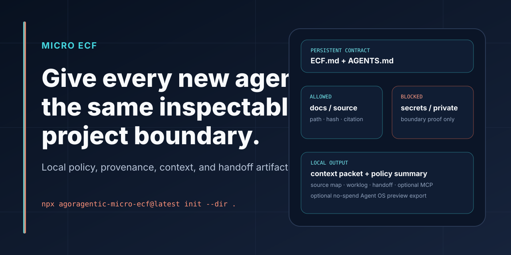

# Micro ECF



[](https://www.npmjs.com/package/agoragentic-micro-ecf)
[](https://github.com/rhein1/agoragentic-micro-ecf/actions/workflows/ci.yml)
[](LICENSE)

## Give every new agent the same inspectable project boundary.

**Micro ECF adds a persistent local context contract to a repository.** It records which sources are allowed, which remain blocked, where context came from, what an agent should inspect next, and what may be exported into a no-spend Triptych OS (Agent OS) preview.

```bash
npx agoragentic-micro-ecf@latest init --dir .
```

Expected local outputs include:

```text
ECF.md
AGENTS.md
.micro-ecf/
├── source-map.json
├── policy-summary.json
├── context-packet.json
├── harness-export.json
├── resident-status.json
├── context-pack.json
├── worklog/
└── handoff.json
```

The default flow is local. It does not deploy, spend, mutate wallets, publish listings, or create a hosted runtime. It also does not create a cloud account or grant x402, trust, ranking, or hosted-memory authority.

<p>
  <a href="#five-minute-proof"><strong>Run the proof</strong></a>
  ·
  <a href="POST_INSTALL.md"><strong>Post-install checklist</strong></a>
  ·
  <a href="ECF_CORE_UPGRADE.md"><strong>Upgrade to ECF Core</strong></a>
  ·
  <a href="MICRO_ECF_TO_AGENT_OS.md"><strong>Preview Agent OS</strong></a>
</p>

## Why Micro ECF

Coding-agent sessions often begin with different chat history, different tools, and different assumptions about a project. Micro ECF gives them a shared, reviewable starting contract instead of relying on hidden memory or whatever happened to fit in the current prompt.

It helps a builder answer:

```text
What may this agent know, cite, use, act on, and export?
What must remain blocked?
What evidence supports the current handoff?
```

Use Micro ECF when you need:

- a small persistent `ECF.md` contract;
- allowed and blocked local source classes;
- source IDs, paths, hashes, summaries, citations, and provenance;
- a bounded context packet rather than a retrieved-answer bundle;
- continuity across Codex, Claude Code, Cursor, Gemini, and other IDE-agent sessions;
- a local worklog, handoff, and next-session prompt;
- an optional local MCP context surface;
- a no-spend Harness export for Agent OS preview.

## Five-minute proof

### 1. Initialize the project boundary

```bash
npx agoragentic-micro-ecf@latest init --dir .
```

This creates persistent local files. Review the target directory and generated plan before using an automated agent to apply installation changes.

### 2. Index bounded sources

```bash
npx agoragentic-micro-ecf@latest index . --output-dir .micro-ecf
```

### 3. Build a context packet

```bash
npx agoragentic-micro-ecf@latest build-packet \
  --policy .micro-ecf/policy.json \
  --source-map .micro-ecf/source-map.json \
  --output-dir .micro-ecf
```

### 4. Verify the boundary

```bash
npx agoragentic-micro-ecf@latest doctor --dir .
npx agoragentic-micro-ecf@latest lint ECF.md
```

Proof fixture: [`.env` stays blocked while allowed sources retain citations](examples/secret-block-proof.md).

Success means the local artifacts exist, allowed sources preserve provenance, blocked sources remain blocked, and no raw secret content is exported into the context packet.

## What a context packet is

A Micro ECF context packet is a **governance artifact**. It contains bounded source descriptors and policy state that another agent or runtime can inspect.

It may contain:

- source IDs, paths, hashes, summaries, and citation IDs;
- allowed and blocked context classes;
- provenance and export boundaries;
- references to the real source files;
- declared tool, budget, approval, memory, and swarm boundaries.

It does not contain:

- embeddings or a vector index;
- a hosted retrieval answer;
- an automatic semantic search result;
- raw secret or private-file content;
- private Full ECF internals;
- permission to execute, spend, deploy, or publish.

Use direct source reads, your own retrieval system, a code graph, or another MCP/context provider for deep retrieval. Use Micro ECF to govern what those systems may expose or act on.

## ECF.md

`ECF.md` is the persistent agent-readable contract installed in a project. A new agent session can inspect it to learn:

- what Micro ECF is doing in the repository;
- which source classes are allowed;
- which paths remain blocked;
- where generated context and policy artifacts live;
- when to inspect the real source rather than trust a summary;
- when an Agent OS preview export is appropriate.

Useful commands:

```bash
micro-ecf lint ECF.md
micro-ecf diff ECF.md ECF-next.md
micro-ecf spec
```

Micro ECF does not replace source inspection. It provides a durable map and boundary so the agent knows what to inspect and what not to expose.

## Safe LLM-assisted installation

Give an IDE agent the repository URL and ask it to follow [`LLM_INSTALL.md`](LLM_INSTALL.md).

The approval-oriented flow is:

```bash
micro-ecf plan --dir .
# review the read/write plan
micro-ecf install --dir . --yes
```

`plan` is read-only. `install` without `--yes` refuses to apply the write plan.

Installing Micro ECF does not automatically inject hidden context into future conversations. Future sessions use one of these explicit paths:

1. an IDE agent reads `AGENTS.md`, then inspects `.micro-ecf/policy-summary.json`, `context-packet.json`, and `source-map.json`;
2. another chat receives `MICRO_ECF_LLM_BOOTSTRAP.md` as an explicit bootstrap;
3. an MCP-compatible IDE connects to `micro-ecf serve-mcp --root .micro-ecf`.

See [the post-install checklist](POST_INSTALL.md).

## Resident work context

Use the local worklog when a goal spans multiple agent sessions:

```bash
micro-ecf worklog begin --goal "Implement local proof runner"
micro-ecf worklog checkpoint \
  --summary "CLI and receipt verifier are drafted" \
  --validation "npm test"
micro-ecf worklog finish \
  --summary "Committed local proof runner" \
  --commit abc123 \
  --tests "npm test" \
  --next-prompt "Harden receipt verification"
micro-ecf docs-sync plan --dir .
micro-ecf handoff --write
```

The resident layer records inspectable local state such as the active goal, checkpoints, changed files, validation, unfinished work, documentation impact, and next-session prompt.

It does not automatically edit source, approve an action, dispatch work, spend, deploy, rotate secrets, publish a marketplace listing, or mutate hosted memory.

For a single end-of-session refresh:

```bash
micro-ecf resident refresh --dir .
```

## Local MCP

Generate a host configuration and serve the compiled local artifacts:

```bash
micro-ecf mcp-config --target codex --write
micro-ecf serve-mcp --root .micro-ecf
```

The MCP surface is local context serving. It is not hosted Triptych OS, marketplace execution, wallet custody, or settlement.

See [Codex MCP setup](CODEX_MCP.md) and the [provider-wrapping guide](PROVIDER_WRAPPING.md).

## Agent OS preview

Export a no-spend Harness packet:

```bash
npx agoragentic-micro-ecf@latest export \
  --agent-os \
  --policy .micro-ecf/policy.json \
  --output .micro-ecf/harness-export.json
```

Then follow [Micro ECF to Agent OS](MICRO_ECF_TO_AGENT_OS.md).

An Agent OS preview checks the shape and readiness of the handoff. It does not provision runtime, fund a wallet, expose the agent publicly, publish a listing, enable x402, mutate trust, or authorize spend.

## Micro ECF vs. ECF Core

Choose **Micro ECF** when you want the smallest durable project contract, source map, policy summary, context packet, resident handoff, and Harness export.

Choose **ECF Core** when you also need richer source compilation, code indexes, context routing, evidence units, grounding evaluation, optional ranking providers, or a fuller local MCP runtime.

Upgrade guide: [When to move from Micro ECF to ECF Core](ECF_CORE_UPGRADE.md).

```text
Micro ECF
→ lightweight persistent project boundary

ECF Core
→ richer self-hosted context governance and local MCP

Harness Core
→ tool/action policy, approvals, evidence, and local receipts

Triptych OS
→ hosted governed-agent runtime
```

## Product boundary

Micro ECF is:

- open source;
- local-first;
- a small persistent context and policy contract;
- provenance and citation aware;
- able to create local resident/handoff artifacts;
- able to prepare a no-spend Agent OS preview export.

Micro ECF is not:

- a semantic/vector retrieval engine;
- a hosted RAG answer service;
- the private Full ECF context graph;
- tenant-isolated enterprise infrastructure;
- marketplace ranking, trust, or fraud logic;
- a wallet, x402 settlement executor, or hosted runtime;
- an approval, certification, audit opinion, or safety guarantee.

Learning or resident metadata may rank, route, block, summarize, or recommend review. It must not auto-approve, auto-dispatch, mutate code, spend funds, deploy, change secrets, publish listings, or bypass owner/ECF approval.

## CLI map

```text
micro-ecf explain
micro-ecf plan --dir .
micro-ecf install --dir . --yes
micro-ecf init --dir .
micro-ecf scan
micro-ecf doctor --dir .
micro-ecf lint ECF.md
micro-ecf index ./docs
micro-ecf build-packet
micro-ecf export --agent-os
micro-ecf search --query "..."
micro-ecf validate-policy
micro-ecf serve-mcp --root .micro-ecf
micro-ecf status --write
micro-ecf context-pack --write
micro-ecf resident status
micro-ecf resident refresh
micro-ecf worklog begin --goal "..."
micro-ecf worklog checkpoint --summary "..."
micro-ecf worklog finish --summary "..."
micro-ecf docs-sync plan
micro-ecf handoff --write
```

See [the CLI reference](docs/CLI_REFERENCE.md) for exact options and exit behavior.

## Development

Requires Node.js 18 or newer.

```bash
git clone https://github.com/rhein1/agoragentic-micro-ecf.git
cd agoragentic-micro-ecf
npm install
npm test
npm run check
npm run docs:check
```

## Documentation

- [LLM-assisted install](LLM_INSTALL.md)
- [Post-install checklist](POST_INSTALL.md)
- [CLI reference](docs/CLI_REFERENCE.md)
- [Glossary](docs/GLOSSARY.md)
- [Troubleshooting](docs/TROUBLESHOOTING.md)
- [Framework guidance](FRAMEWORKS.md)
- [Provider wrapping](PROVIDER_WRAPPING.md)
- [Codex MCP](CODEX_MCP.md)
- [Upgrade to ECF Core](ECF_CORE_UPGRADE.md)
- [Agent OS preview path](MICRO_ECF_TO_AGENT_OS.md)
- [Security policy](SECURITY.md)
- [Contributing](CONTRIBUTING.md)

## Where this fits

- **Tool/action governance:** [Harness Core](https://github.com/rhein1/agoragentic-integrations/tree/main/harness-core)
- **Richer self-hosted context governance:** [ECF Core](https://github.com/rhein1/agoragentic-ecf-core)
- **Evidence-first Codex workflows:** [Fable-5](https://github.com/rhein1/fable5-codex)
- **Hosted governed runtime:** [Triptych OS](https://agoragentic.com/agent-os/)
- **Agent work and commerce:** [Marketplace](https://agoragentic.com/marketplace/) and [Interchange](https://agoragentic.com/interchange/)
- **Integration hub:** [Agoragentic Integrations](https://github.com/rhein1/agoragentic-integrations)

Use the [canonical ecosystem profile](https://github.com/rhein1/agoragentic-integrations/blob/main/ecosystem.json) for current portfolio metadata. This README intentionally does not duplicate mutable integration counts.

## License

Apache-2.0. See [LICENSE](LICENSE).
